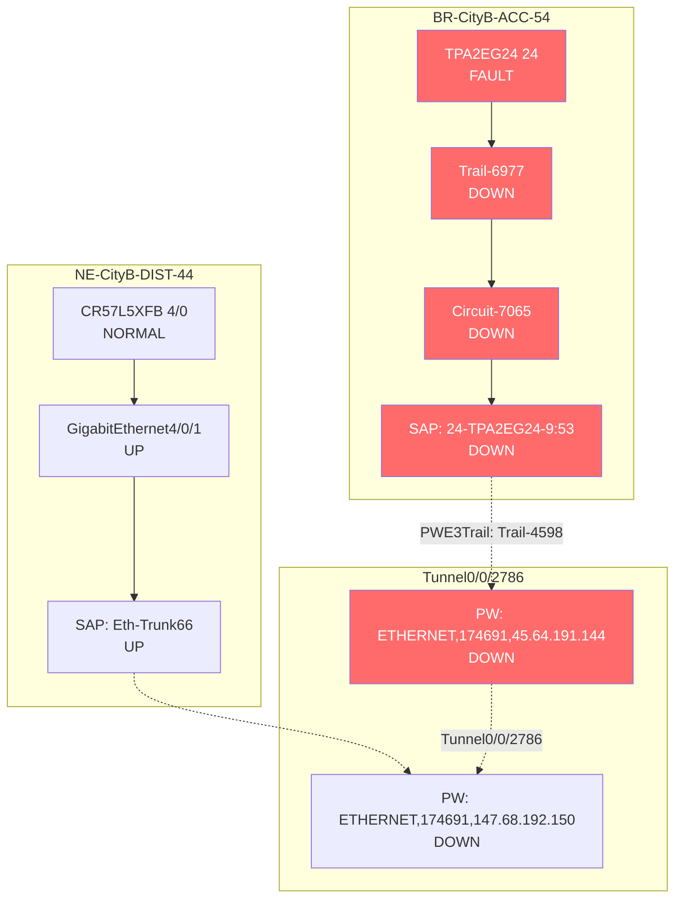

# SPN 故障诊断评测用例 - TPA2EG24 24 单板硬件故障

## 1. 根因定义与组网拓扑

### 1.1 根因说明
* **根因类型**：硬件单板故障 (Card Fault)
* **根因对象**：`TPA2EG24 24` (resId: `68ae10be-235d-11ea-b4b3-286ed4a6f283`)
* **所属网元**：`BR-CityB-ACC-54` (resId: `ad86ee9a-235e-11ea-b3e4-286ed4a6f27b`)
* **故障机理**：LPU 单板底层硬件寄存器异常或驱动故障，导致单板状态机进入 `FAULT` 隔离态。系统为防止错误数据转发，强制将该单板下挂的所有物理端口 PHY 层 Shutdown，并停止光模块发光。

### 1.2 组网与拓扑图

> mermaid 语法描述拓扑图



## 2. 根因影响链 (传导路径)

故障从物理硬件层逐层向上层业务传导，形成完整的影响链条：

1. **L0 硬件层 (根因)**：单板 `TPA2EG24 24` 发生硬件故障，`cardStatus` 变为 `FAULT`。
2. **L1 物理端口层 (本端)**：单板驱动隔离，导致该板下挂的物理端口 `Trail-6977` 被强制 Down，光模块停止发光。`portOpticalPowerErrCode` 报 `BOARD_STATUS_ABNORMAL`。
3. **L2 逻辑聚合层**：`Circuit-7065` 作为 `Trail-6977` 的子接口，随父端口 Down 而 Down。
4. **L3 业务接入层**：SAP `24-TPA2EG24-9:53` 绑定在 `Circuit-7065` 上，导致 SAP 状态 Down，业务面 100% 丢包。
5. **L4 伪线层**：SAP 关联的 PWE3XC `name` 及 PW `PW(ETHERNET,174691,45.64.191.144)` 因底层链路中断而去激活，`pwOperateStatus` 变为 `down`。
6. **L5 隧道层**：PWTrail `2bdba388-4ebd-11ec-8000-286ed4a6f218` 绑定的 `Tunnel0/0/2786` OAM 连续性检测中断，`tunnelOperateStatus` 变为 `down`。
7. **L6 告警层**：网管系统按时间序列依次收到 `BOARD_FAULT` (T0) -> `PORT_DOWN` (T0+2s) -> `PW_DOWN` (T0+3s) -> `TUNNEL_DOWN` (T0+5s)。

---

## 3. 受影响对象范围界定与证据链 (关联查找逻辑)

在构建 Mock 数据时，必须通过拓扑关联关系找出**所有受波及的对象范围**。以下为每一步查找逻辑的权威协议与规范依据及文档链接：

| 对象层级 | 受影响范围界定规则 (查找逻辑) | 具体枚举对象 (基于当前 Topo) | 证据链 / 权威参考依据 (传导原理) |
| :--- | :--- | :--- | :--- |
| **故障单板** | 根因对象本身。 | `TPA2EG24 24` (resId: `68ae10be-235d-11ea-b4b3-286ed4a6f283`) | **ITU-T X.731** (管理信息模型) / **TMF SID** (共享信息数据模型)：硬件故障是物理层最底层的 Root Cause，状态机进入 `FAULT` 态。<br>[ITU-T X.731 链接](https://www.itu.int/rec/T-REC-X.731/en) \| [TMF SID 链接](https://www.tmforum.org/resources/sid/) |
| **同板物理端口** | 查找 `FixedNetworkLTP.refParentCard == 故障单板.resId` 且 `isPhysical == true` 的所有端口。 | `Trail-6977` (resId: `79a553f1-235d-11ea-b4b3-286ed4a6f283`) | **IEEE 802.3 (Clause 30 MAU/PHY)**：单板管理芯片检测到硬件不可恢复故障时，会向端口驱动下发 `FORCE_DOWN` 指令，隔离该板卡下所有 LTP，光模块 TX 关闭。<br>[IEEE 802.3 链接](https://standards.ieee.org/ieee/802.3/4393/) |
| **逻辑子接口** | 查找 `FixedNetworkLTP.refParentLTP == 同板物理端口.resId` 的所有逻辑端口。 | `Circuit-7065` (resId: `2a35ffe9-4ebd-11ec-a925-286ed4a6f283`) | **IEEE 802.1Q** (VLAN Tagging)：子接口依赖父物理端口存在。父端口 Down 导致所有子接口逻辑状态 Down。<br>[IEEE 802.1Q 链接](https://standards.ieee.org/ieee/802.1Q/4321/) |
| **SAP 业务接入点** | 查找 `ServiceAccessPoint.refBindingLTP` 或 `refPort` 包含上述端口的 SAP。 | `24-TPA2EG24-9:53` (resId: `2bd7e05e-4ebd-11ec-8000-286ed4a6f218`) | **MEF 6.1** (以太网服务模型)：SAP 绑定在 LTP 上，底层端口故障导致 SAP 无法收发业务帧，状态 Down。<br>[MEF 6.1 链接](https://www.mef.net/technical-specifications/mef-6-1/) |
| **PWE3XC 交叉连接** | 查找 `PWE3XC.refEndLTPList` 包含上述 SAP 的 XC 对象。 | `name` (resId: `317ace4a-4ebd-11ec-a631-286ed4a6f22a`) | **IETF RFC 4447** (PWE3)：XC 是 PW 与 SAP 的交叉连接点。SAP Down 触发 XC 去激活。<br>[RFC 4447 链接](https://datatracker.ietf.org/doc/html/rfc4447) |
| **承载伪线 (PW)** | 查找 `PWE3XC.refZEndPWList` 或 `PWTrail.refAEndPW/refZEndPW` 中包含的 PW。 | `PW(ETHERNET,174691,45.64.191.144)` (resId: `30cefeb1-4ebd-11ec-a631-286ed4a6f22a`) | **IETF RFC 4448** (PWE3 Ethernet)：PW 一端失效导致整条 PW 去激活，`pwOperateStatus` 变为 `down`。<br>[RFC 4448 链接](https://datatracker.ietf.org/doc/html/rfc4448) |
| **PWE3Trail** | 查找 `PWE3Trail.refAEndNE1` 或 `refZEndNE1` 涉及故障网元的 Trail。 | `Trail-4598` (resId: `2bd41154-4ebd-11ec-8000-286ed4a6f218`) | **ITU-T G.8011** (以太网 over MPLS)：Trail 是端到端的伪线路径，任一 SAP 或 PW 故障导致整条 Trail 中断。<br>[G.8011 链接](https://www.itu.int/rec/T-REC-G.8011) |
| **PWTrail** | 查找 `PWTrail.refPwe3Trail == PWE3Trail.resId` 的 PWTrail 对象。 | `2bdba388-4ebd-11ec-8000-286ed4a6f218` | **3GPP TS 28.531** (故障管理)：PWTrail 关联两端 PW 和底层 Tunnel，用于端到端故障定界。<br>[TS 28.531 链接](https://www.3gpp.org/DynaReport/28531.htm) |
| **承载隧道** | 查找 `PWTrail.refTunnelList` 或 `TunnelHop.refTunnelTrail` 中包含的 Tunnel。 | `Tunnel0/0/2786` (resId: `70fe0604-afc0-11ec-8000-286ed4a6f218`) | **IETF RFC 4379** (MPLS LSP Ping/Trace) / **ITU-T G.8113.1** (MPLS-TP OAM)：MPLS-TP 隧道依赖逐跳转发。OAM 连续性检测 (CCM) 超时或 Trace 探测报文无法封装发送。<br>[RFC 4379 链接](https://datatracker.ietf.org/doc/html/rfc4379) \| [G.8113.1 链接](https://www.itu.int/rec/T-REC-G.8113.1) |
| **对端 PW** | 查找 `PWTrail.refZEndPW` 中的对端 PW。 | `PW(ETHERNET,174691,147.68.192.150)` (resId: `30cefeb6-4ebd-11ec-a631-286ed4a6f22a`) | **IETF RFC 4447**：PW 是双向的，一端故障导致对端 PW 也感知到缺陷状态。<br>[RFC 4447 链接](https://datatracker.ietf.org/doc/html/rfc4447) |

---

## 4. 全量 API 字段受影响详细清单 (100% 逐行展开)

> **说明**：以下表格穷尽了 API Schema 中的**所有字段路径**，无任何省略。

| API 类别 | 字段路径 | 是否受影响 | 受影响对象范围/查找逻辑 | 预期 Mock 结果 | 影响说明与传导逻辑 |
| :--- | :--- | :---: | :--- | :--- | :--- |
| **card** | `cardList.cardCategory` | 否 | 全局对象 | `"LPU"` | 固有属性。 |
| **card** | `cardType` | 否 | 故障单板本身 | `"LPU"` | 固有属性。 |
| **card** | `cardRegistered` | 否 | 故障单板本身 | `true` | 单板在位。 |
| **card** | `cardStatus` | **是** | 故障单板 `TPA2EG24 24` | `"FAULT"` | **根因所在**，硬件状态机隔离。 |
| **card** | `currentAlarms` | **是** | 故障单板本身 | `["BOARD_FAULT"]` | 产生单板级根源告警。 |
| **port** | `isPhysical` | 否 | 所有端口 | `true` / `false` | 固有属性，不随故障改变。 |
| **port** | `portType` | 否 | 所有端口 | `"Physical"` / `"Sub-interface"` | 固有属性。 |
| **port** | `activeMemberCount` | 否 | 全局对象 | `null` | 非 Eth-Trunk 口。 |
| **port** | `totalMemberCount` | 否 | 全局对象 | `null` | 非 Eth-Trunk 口。 |
| **port** | `currentAlarms` | **是** | 同板物理端口 `Trail-6977` | `["ETH_LOS", "PORT_DOWN"]` | 端口 Down 触发的衍生告警。 |
| **port** | `isSameFecMode` | 否 | 全局对象 | `true` | 未受此次硬件故障波及。 |
| **port** | `isSamePortWorkMode` | 否 | 全局对象 | `true` | 未受此次硬件故障波及。 |
| **port** | `portAdminStatus` | 否 | 全局对象 | `"up"` | 管理状态未变（非人为 Shutdown）。 |
| **port** | `portOperateStatus` | **是** | 同板物理端口 `Trail-6977` | `"down"` | 单板故障联动端口 PHY Down。 |
| **port** | `portOpticalPowerStatus` | **是** | 同板物理端口 `Trail-6977` | `"abnormal"` | 单板异常导致光模块不可用。 |
| **port** | `inPower` | **是** | 同板物理端口 `Trail-6977` | `-50.0` | 实际光功率跌落至底噪。 |
| **port** | `inPowerStatus` | **是** | 同板物理端口 `Trail-6977` | `"无光"` | 单板异常导致停止发光/收无光。 |
| **port** | `outPower` | **是** | 同板物理端口 `Trail-6977` | `-50.0` | 实际光功率跌落至底噪。 |
| **port** | `outPowerStatus` | **是** | 同板物理端口 `Trail-6977` | `"无光"` | 单板异常导致停止发光。 |
| **port** | `portOpticalPowerErrCode` | **是** | 同板物理端口 `Trail-6977` | `"BOARD_STATUS_ABNORMAL"` | **核心定界字段**：证明非光纤断裂。 |
| **port** | `portOpticalPowerDetails.portOpticalPowerInfo.inPower` | **是** | 同板物理端口 `Trail-6977` | `-50.0` | 详细光功率值越限。 |
| **port** | `portOpticalPowerDetails.portOpticalPowerInfo.minInPower` | 否 | 全局对象 | `-20.0` | 门限配置不变。 |
| **port** | `portOpticalPowerDetails.portOpticalPowerInfo.maxInPower` | 否 | 全局对象 | `0.0` | 门限配置不变。 |
| **port** | `portOpticalPowerDetails.portOpticalPowerInfo.outPower` | **是** | 同板物理端口 `Trail-6977` | `-50.0` | 详细光功率值越限。 |
| **port** | `portOpticalPowerDetails.portOpticalPowerInfo.minOutPower` | 否 | 全局对象 | `-15.0` | 门限配置不变。 |
| **port** | `portOpticalPowerDetails.portOpticalPowerInfo.maxOutPower` | 否 | 全局对象 | `5.0` | 门限配置不变。 |
| **port** | `isOffline` | 否 | 全局对象 | `false` | 对端网元未掉电。 |
| **port** | `isManagedPE` | 否 | 全局对象 | `true` | 对端纳管状态未变。 |
| **port** | `isNormal` | **是** | 同板物理端口 `Trail-6977` | `false` | 网络异常。 |
| **port** | `isOpticalNormal` | **是** | 同板物理端口 `Trail-6977` | `false` | 光功率异常。 |
| **port** | `aEndAlarmNames` | **是** | 同板物理端口 `Trail-6977` | `"ETH_LOS,PORT_DOWN"` | 本端历史告警。 |
| **port** | `zEndAlarmNames` | 否 | 全局对象 | `""` | 对端历史告警未变。 |
| **link** | `localPortFaultType` | 否 | 全局对象 | `"Normal"` | 此场景不涉及 FixedNetworkLink 直接关联。 |
| **link** | `localPortDetailInfo` | 否 | 全局对象 | `""` | 无。 |
| **link** | `remotePortFaultType` | 否 | 全局对象 | `"Unknown"` | 无。 |
| **link** | `remotePortDetailInfo` | 否 | 全局对象 | `"对端设备未纳管/不在拓扑范围内"` | 无。 |
| **tunnel** | `tunnelOperateStatus` | **是** | `Tunnel0/0/2786` | `"down"` | 隧道 OAM 检测中断。 |
| **tunnel** | `tunnelOamStatus` | **是** | `Tunnel0/0/2786` | `"timeout"` | OAM 超时。 |
| **tunnel** | `currentAlarms` | **是** | `Tunnel0/0/2786` | `["TUNNEL_DOWN"]` | 隧道告警。 |
| **tunnel** | `remainBwForAllTunnels` | 否 | 全局对象 | 正常数值 | 未受此次硬件故障波及。 |
| **tunnel** | `remainBwRatioForAllTunnels` | 否 | 全局对象 | 正常数值 | 未受此次硬件故障波及。 |
| **tunnel** | `tunnelResults.tunnelRemainBw` | 否 | 全局对象 | 正常字符串 | 未受此次硬件故障波及。 |
| **tunnel** | `tunnelResults.tunnelRemainBwRatio` | 否 | 全局对象 | 正常字符串 | 未受此次硬件故障波及。 |
| **tunnel** | `tunnelResults.hopRemainBw.linkId` | 否 | 全局对象 | 正常字符串 | 未受此次硬件故障波及。 |
| **tunnel** | `tunnelResults.hopRemainBw.linkTopoId` | 否 | 全局对象 | 正常字符串 | 未受此次硬件故障波及。 |
| **tunnel** | `tunnelResults.hopRemainBw.linkName` | 否 | 全局对象 | 正常字符串 | 未受此次硬件故障波及。 |
| **tunnel** | `tunnelResults.hopRemainBw.remainBw` | 否 | 全局对象 | 正常字符串 | 未受此次硬件故障波及。 |
| **tunnel** | `tunnelResults.hopRemainBw.remainBwRatio` | 否 | 全局对象 | 正常字符串 | 未受此次硬件故障波及。 |
| **tunnel** | `topoObj.nodes.commuState` | 否 | 故障网元 | `"0"` | 网元在线。 |
| **tunnel** | `incidentObjList` | **是** | `Tunnel0/0/2786` | `{...}` | 包含故障事件。 |
| **tunnel** | `faultPortResIdList` | **是** | `Tunnel0/0/2786` | `["79a553f1-235d-11ea-b4b3-286ed4a6f283"]` | 关联故障端口。 |
| **tunnel** | `faultNeResIdList` | **是** | `Tunnel0/0/2786` | `["ad86ee9a-235e-11ea-b3e4-286ed4a6f27b"]` | 关联故障网元。 |
| **tunnel** | `faultCardResIdList` | **是** | `Tunnel0/0/2786` | `["68ae10be-235d-11ea-b4b3-286ed4a6f283"]` | 关联故障单板。 |
| **tunnel** | `alarmObjList` | **是** | `Tunnel0/0/2786` | `{...}` | 关联告警对象。 |
| **tunnel** | `notPingReachableTunnelObjList` | **是** | `Tunnel0/0/2786` | `{...}` | Ping 不通。 |
| **tunnel** | `pingRstObjList` | **是** | `Tunnel0/0/2786` | `{...}` | Ping 结果超时。 |
| **tunnel** | `notTraceReachableTunnelObjList` | **是** | `Tunnel0/0/2786` | `{...}` | Trace 不通。 |
| **tunnel** | `traceRstObjList.tunnelObj.name` | 否 | 全局对象 | `"Tunnel0/0/2786"` | 隧道基础信息。 |
| **tunnel** | `traceRstObjList.tunnelObj.role` | 否 | 全局对象 | `"WORK"` | 隧道基础信息。 |
| **tunnel** | `traceRstObjList.tunnelObj.instance` | 否 | 全局对象 | `{...}` | 透传数据结构。 |
| **tunnel** | `traceRstObjList.tunnelObj.srcNeName` | 否 | 全局对象 | `"NE-CityB-DIST-44"` | 隧道基础信息。 |
| **tunnel** | `traceRstObjList.tunnelObj.snkNeName` | 否 | 全局对象 | `"BR-CityB-ACC-54"` | 隧道基础信息。 |
| **tunnel** | `traceRstObjList.traceRstList.errorCode` | **是** | Trace 失败跳数 | `1` | Trace 失败。 |
| **tunnel** | `traceRstObjList.traceRstList.sourceName` | 否 | 全局对象 | `"NE-CityB-DIST-44"` | 基础路由信息。 |
| **tunnel** | `traceRstObjList.traceRstList.desName` | 否 | 全局对象 | `"BR-CityB-ACC-54"` | 基础路由信息。 |
| **tunnel** | `traceRstObjList.traceRstList.direction` | 否 | 全局对象 | `"forward"` | 基础路由信息。 |
| **tunnel** | `traceRstObjList.traceRstList.role` | 否 | 全局对象 | `"WORK"` | 基础路由信息。 |
| **tunnel** | `traceRstObjList.traceRstList.reason` | **是** | Trace 失败跳数 | `"单板 FAULT 导致端口 Down"` | 失败原因。 |
| **tunnel** | `traceRstObjList.traceRstList.tunnelName` | 否 | 全局对象 | `"Tunnel0/0/2786"` | 基础路由信息。 |
| **tunnel** | `traceRstObjList.traceRstList.tracerHop.seq` | **是** | Trace 失败跳数 | `1` | 逐跳序号。 |
| **tunnel** | `traceRstObjList.traceRstList.tracerHop.midIp` | **是** | Trace 失败跳数 | `"10.1.1.1"` | 中间 IP。 |
| **tunnel** | `traceRstObjList.traceRstList.tracerHop.minDelay` | **是** | Trace 失败跳数 | `-1` | 失败时无时延。 |
| **tunnel** | `traceRstObjList.traceRstList.tracerHop.maxDelay` | **是** | Trace 失败跳数 | `-1` | 失败时无时延。 |
| **tunnel** | `traceRstObjList.traceRstList.tracerHop.avgDelay` | **是** | Trace 失败跳数 | `-1` | 失败时无时延。 |
| **tunnel** | `traceRstObjList.traceRstList.nodeDiagnoseInfo.refNeName` | **是** | Trace 失败跳数 | `"BR-CityB-ACC-54"` | 挂载网元名称。 |
| **tunnel** | `traceRstObjList.traceRstList.nodeDiagnoseInfo.neStatus` | 否 | Trace 失败跳数 | `"online"` | 网元在线。 |
| **tunnel** | `traceRstObjList.traceRstList.nodeDiagnoseInfo.portName` | **是** | Trace 失败跳数 | `"Trail-6977"` | 故障端口名称。 |
| **tunnel** | `traceRstObjList.traceRstList.nodeDiagnoseInfo.operateStatus`| **是** | Trace 失败跳数 | `"down"` | 透传故障端口状态。 |
| **tunnel** | `traceRstObjList.traceRstList.nodeDiagnoseInfo.adminStatus` | 否 | Trace 失败跳数 | `"up"` | 管理状态未变。 |
| **tunnel** | `traceRstObjList.traceRstList.nodeDiagnoseInfo.alarmNum` | **是** | Trace 失败跳数 | `"3"` | 告警条数。 |
| **tunnel** | `traceRstObjList.traceRstList.nodeDiagnoseInfo.alarmNames` | **是** | Trace 失败跳数 | `"BOARD_FAULT,PORT_DOWN,PW_DOWN"` | 告警名称。 |
| **tunnel** | `traceRstObjList.traceRstList.nodeDiagnoseInfo.powerStatus` | **是** | Trace 失败跳数 | `"异常"` | 光功率状态异常。 |
| **tunnel** | `isFillTunnelObjList` | 否 | 全局对象 | `false` | 未补充。 |
| **alarm** | `alarms.csn` | **是** | 全局告警流水 | `"ALM-001"` | 生成新流水号。 |
| **alarm** | `alarms.alarmName` | **是** | 全局告警流水 | `"BOARD_FAULT"` | 告警名称。 |
| **alarm** | `alarms.occurUtc` | **是** | 全局告警流水 | `1717200000000` | 发生时间，用于根因排序。 |
| **alarm** | `alarms.clearUtc` | 否 | 全局告警流水 | `0` | 未清除。 |
| **alarm** | `alarms.extParam` | **是** | 全局告警流水 | `"0x01 0x02..."` | 硬件错误码。 |
| **alarm** | `alarms.resourceResId` | **是** | 全局告警流水 | `"68ae10be-235d-11ea-b4b3-286ed4a6f283"` | 锚定具体资源对象。 |
| **alarm** | `alarms.resourceType` | **是** | 全局告警流水 | `"Card"` | 资源类型。 |
| **alarm** | `alarmNames` | **是** | 全局告警流水 | `"BOARD_FAULT,PORT_DOWN,PW_DOWN,TUNNEL_DOWN"` | 聚合告警名。 |
| **alarm** | `deviceType` | 否 | 全局对象 | `"PTN6900"` | 设备型号。 |
| **base_station**| `accessRingObj` | 否 | 全局对象 | 保持默认值 | 未受此次硬件故障波及。 |
| **base_station**| `aggregationRingObj` | 否 | 全局对象 | 保持默认值 | 未受此次硬件故障波及。 |
| **base_station**| `offLineRangeTopoObjList` | 否 | 全局对象 | 保持默认值 | 未受此次硬件故障波及。 |
| **base_station**| `sapOfflineRangeObjList` | 否 | 全局对象 | 保持默认值 | 未受此次硬件故障波及。 |
| **clock** | `alarms` | 否 | 全局对象 | 保持默认值 | 未受此次硬件故障波及。 |
| **clock** | `clockPathList` | 否 | 全局对象 | 保持默认值 | 未受此次硬件故障波及。 |
| **clock** | `alarmNeResId` | 否 | 全局对象 | 保持默认值 | 未受此次硬件故障波及。 |
| **ne** | `currentAlarms` | **是** | 故障网元 `BR-CityB-ACC-54` | `["BOARD_FAULT"]` | 网元级告警聚合。 |
| **ne** | `neStatus` | 否 | 故障网元 | `"online"` | 网元整体在线。 |
| **ne** | `topoObj` | 否 | 全局对象 | 保持默认值 | 未受此次硬件故障波及。 |
| **ne** | `incidentObjList` | **是** | 故障网元 | `{...}` | 故障事件。 |
| **ne** | `faultPortResIdList` | **是** | 故障网元 | `["79a553f1-235d-11ea-b4b3-286ed4a6f283"]` | 故障端口列表。 |
| **ne** | `faultNeResIdList` | 否 | 故障网元 | `[]` | 自身非故障网元。 |
| **ne** | `faultCardResIdList` | **是** | 故障网元 | `["68ae10be-235d-11ea-b4b3-286ed4a6f283"]` | 故障单板列表。 |
| **ne** | `alarmObjList` | **是** | 故障网元 | `{...}` | 告警对象。 |
| **ne** | `offlineRangeCategory` | 否 | 全局对象 | `"NORMAL"` | 无脱管区域。 |
| **ne** | `isPortAllDown` | 否 | 故障网元 | `false` | 假设还有其他板卡。 |
| **ne** | `portAlarmObjList` | **是** | 故障网元 | `{...}` | 端口告警。 |
| **ne** | `contemporaneous` | 否 | 全局对象 | 保持默认值 | 未受此次硬件故障波及。 |
| **ne** | `resetInTimeDifference` | 否 | 全局对象 | 保持默认值 | 未受此次硬件故障波及。 |
| **ne** | `resetRecords` | 否 | 全局对象 | 保持默认值 | 未受此次硬件故障波及。 |
| **ne** | `clkTimeLockSta` | 否 | 全局对象 | 保持默认值 | 未受此次硬件故障波及。 |
| **ne** | `clkFreqLockSta` | 否 | 全局对象 | 保持默认值 | 未受此次硬件故障波及。 |
| **ne** | `poPtpSrcTraceClkid` | 否 | 全局对象 | 保持默认值 | 未受此次硬件故障波及。 |
| **ne** | `hasPtpSetUni` | 否 | 全局对象 | 保持默认值 | 未受此次硬件故障波及。 |
| **ne** | `poPtpPreSetState` | 否 | 全局对象 | 保持默认值 | 未受此次硬件故障波及。 |
| **ne** | `poPtpRealPortState` | 否 | 全局对象 | 保持默认值 | 未受此次硬件故障波及。 |
| **ne** | `poPtpSyncInterval` | 否 | 全局对象 | 保持默认值 | 未受此次硬件故障波及。 |
| **ne** | `poPtpDlyReqInterval` | 否 | 全局对象 | 保持默认值 | 未受此次硬件故障波及。 |
| **ne** | `poPtpAnnInterval` | 否 | 全局对象 | 保持默认值 | 未受此次硬件故障波及。 |
| **ne** | `maxPassive` | 否 | 全局对象 | 保持默认值 | 未受此次硬件故障波及。 |
| **ne** | `passiveList` | 否 | 全局对象 | 保持默认值 | 未受此次硬件故障波及。 |
| **ne** | `nePortDCNStatusList.name` | 否 | 全局对象 | 保持默认值 | 未受此次硬件故障波及。 |
| **ne** | `nePortDCNStatusList.productName` | 否 | 全局对象 | 保持默认值 | 未受此次硬件故障波及。 |
| **ne** | `nePortDCNStatusList.commuState` | 否 | 全局对象 | 保持默认值 | 未受此次硬件故障波及。 |
| **ne** | `nePortDCNStatusList.portObjList.name` | 否 | 全局对象 | 保持默认值 | 未受此次硬件故障波及。 |
| **ne** | `nePortDCNStatusList.portObjList.neNativeId` | 否 | 全局对象 | 保持默认值 | 未受此次硬件故障波及。 |
| **ne** | `nePortDCNStatusList.portObjList.nativeId` | 否 | 全局对象 | 保持默认值 | 未受此次硬件故障波及。 |
| **ne** | `nePortDCNStatusList.portObjList.operateState` | 否 | 全局对象 | 保持默认值 | 未受此次硬件故障波及。 |
| **ne** | `nePortDCNStatusList.portObjList.adminState` | 否 | 全局对象 | 保持默认值 | 未受此次硬件故障波及。 |
| **ne** | `nePortDCNStatusList.lspPingResult.notPingReachableTunnelObjList`| 否 | 全局对象 | 保持默认值 | 未受此次硬件故障波及。 |
| **ne** | `nePortDCNStatusList.lspPingResult.pingRstObjList` | 否 | 全局对象 | 保持默认值 | 未受此次硬件故障波及。 |
| **ne** | `dcnFaultType` | 否 | 全局对象 | `"NONE"` | 无 DCN 故障。 |
| **ne** | `offlineOrMpuFaultNeResIds` | 否 | 全局对象 | `[]` | 无离线网元。 |
| **ne** | `downAndDcnEnabledPortResIds` | **是** | 故障网元 | `["79a553f1-235d-11ea-b4b3-286ed4a6f283"]` | Down 且使能 DCN 的端口。 |
| **ring** | `incidentObjList` | 否 | 全局对象 | 保持默认值 | 未受此次硬件故障波及。 |
| **ring** | `faultPortResIdList` | 否 | 全局对象 | 保持默认值 | 未受此次硬件故障波及。 |
| **ring** | `faultNeResIdList` | 否 | 全局对象 | 保持默认值 | 未受此次硬件故障波及。 |
| **ring** | `faultCardResIdList` | 否 | 全局对象 | 保持默认值 | 未受此次硬件故障波及。 |
| **ring** | `alarmObjList` | 否 | 全局对象 | 保持默认值 | 未受此次硬件故障波及。 |
| **service** | `sapStatus` | **是** | SAP `24-TPA2EG24-9:53` | `"down"` | 业务接入点状态 Down。 |
| **service** | `bindingPwStatus` | **是** | SAP `24-TPA2EG24-9:53` | `"down"` | 绑定 PW 状态。 |
| **service** | `isPacketLoss` | **是** | SAP `24-TPA2EG24-9:53` | `true` | 业务丢包。 |
| **service** | `isL3Vpn` | 否 | 全局对象 | `false` | 业务类型。 |
| **service** | `pingRstObjList` | **是** | SAP `24-TPA2EG24-9:53` | `{...}` | Ping 结果超时。 |
| **pw** | `pwOperateStatus` | **是** | `PW(ETHERNET,174691,45.64.191.144)` | `"down"` | 底层 SAP/Tunnel Down 导致 PW 去激活。 |
| **pw** | `pwOamStatus` | **是** | `PW(ETHERNET,174691,45.64.191.144)` | `"defect"` | OAM 缺陷。 |
| **pw** | `pwFaultType` | **是** | `PW(ETHERNET,174691,45.64.191.144)` | `"SAP_DOWN"` | 明确 PW 故障原因。 |
| **pw** | `currentAlarms` | **是** | `PW(ETHERNET,174691,45.64.191.144)` | `["PW_DOWN"]` | PW 告警。 |
| **pw** | `bindingTunnelStatus` | **是** | `PW(ETHERNET,174691,45.64.191.144)` | `"down"` | 绑定隧道状态。 |

---

## 5. Agent 诊断 SOP 与推理逻辑

期望大模型 Agent 在接收到"业务丢包"初始 Prompt 后，遵循以下标准作业程序（SOP）：

1. **业务层触发与定界 (Step 1)**
   - 调用 `service` API，发现 SAP `24-TPA2EG24-9:53` 的 `sapStatus=down`，`isPacketLoss=true`。
   - 检查 `bindingPwStatus=down`，初步判断问题在伪线层或更底层。

2. **伪线层追溯 (Step 2)**
   - 调用 `pw` API，查询 `PW(ETHERNET,174691,45.64.191.144)`，发现 `pwOperateStatus=down`，`pwFaultType=SAP_DOWN`。
   - 关键定界：`pwFaultType=SAP_DOWN` 表明故障源在 SAP 侧，而非 Tunnel 侧。

3. **SAP 与端口层定位 (Step 3)**
   - 调用 `port` API，查询 SAP 绑定的 `Trail-6977` 和 `Circuit-7065`。
   - 发现 `Trail-6977` 的 `portOperateStatus=down`，`portOpticalPowerErrCode=BOARD_STATUS_ABNORMAL`。
   - **关键推理**：`BOARD_STATUS_ABNORMAL` 错误码明确指向单板故障，而非光纤断裂或光模块故障。

4. **单板层确认根因 (Step 4)**
   - 调用 `card` API，查询 `Trail-6977` 所属的单板 `TPA2EG24 24`。
   - 发现 `cardStatus=FAULT`，`currentAlarms=["BOARD_FAULT"]`。
   - **根因确认**：单板硬件故障是导致所有上层业务中断的根源。

5. **影响范围评估 (Step 5)**
   - 调用 `tunnel` API，查询关联的 `Tunnel0/0/2786`，发现 `tunnelOperateStatus=down`。
   - 调用 `ne` API，查询网元 `BR-CityB-ACC-54`，确认网元在线 (`neStatus=online`)，排除网元脱管可能。
   - 输出完整影响链：`TPA2EG24 24 (FAULT)` → `Trail-6977 (DOWN)` → `SAP 24-TPA2EG24-9:53 (DOWN)` → `PW (DOWN)` → `Tunnel0/0/2786 (DOWN)`。

6. **根因结论输出**
   - **根因对象**：`TPA2EG24 24` (Card)
   - **根因类型**：硬件单板故障
   - **建议操作**：更换故障单板，检查背板连接。

---

## 6. Mock 数据 JSON 示例

```json
{
  "card": {
    "cardList": [
      {
        "resId": "68ae10be-235d-11ea-b4b3-286ed4a6f283",
        "name": "TPA2EG24 24",
        "cardCategory": "LPU",
        "cardType": "LPU",
        "cardRegistered": true,
        "cardStatus": "FAULT",
        "currentAlarms": ["BOARD_FAULT"],
        "refParentNE": "ad86ee9a-235e-11ea-b3e4-286ed4a6f27b"
      }
    ]
  },
  "port": {
    "portList": [
      {
        "resId": "79a553f1-235d-11ea-b4b3-286ed4a6f283",
        "name": "Trail-6977",
        "isPhysical": true,
        "portType": "Physical",
        "portAdminStatus": "up",
        "portOperateStatus": "down",
        "portOpticalPowerStatus": "abnormal",
        "inPower": -50.0,
        "inPowerStatus": "无光",
        "outPower": -50.0,
        "outPowerStatus": "无光",
        "portOpticalPowerErrCode": "BOARD_STATUS_ABNORMAL",
        "currentAlarms": ["ETH_LOS", "PORT_DOWN"],
        "isNormal": false,
        "isOpticalNormal": false,
        "refParentCard": "68ae10be-235d-11ea-b4b3-286ed4a6f283",
        "refParentNE": "ad86ee9a-235e-11ea-b3e4-286ed4a6f27b"
      },
      {
        "resId": "2a35ffe9-4ebd-11ec-a925-286ed4a6f283",
        "name": "Circuit-7065",
        "isPhysical": false,
        "portType": "Sub-interface",
        "portOperateStatus": "down",
        "refParentLTP": "79a553f1-235d-11ea-b4b3-286ed4a6f283"
      }
    ]
  },
  "service": {
    "sapList": [
      {
        "resId": "2bd7e05e-4ebd-11ec-8000-286ed4a6f218",
        "name": "24-TPA2EG24-9:53",
        "sapStatus": "down",
        "bindingPwStatus": "down",
        "isPacketLoss": true,
        "refBindingLTP": "2a35ffe9-4ebd-11ec-a925-286ed4a6f283",
        "refPort": "79a553f1-235d-11ea-b4b3-286ed4a6f283"
      }
    ]
  },
  "pw": {
    "pwList": [
      {
        "resId": "30cefeb1-4ebd-11ec-a631-286ed4a6f22a",
        "name": "PW(ETHERNET,174691,45.64.191.144)",
        "pwOperateStatus": "down",
        "pwOamStatus": "defect",
        "pwFaultType": "SAP_DOWN",
        "currentAlarms": ["PW_DOWN"],
        "bindingTunnelStatus": "down"
      }
    ]
  },
  "tunnel": {
    "tunnelList": [
      {
        "resId": "70fe0604-afc0-11ec-8000-286ed4a6f218",
        "name": "Tunnel0/0/2786",
        "tunnelOperateStatus": "down",
        "tunnelOamStatus": "timeout",
        "currentAlarms": ["TUNNEL_DOWN"],
        "faultCardResIdList": ["68ae10be-235d-11ea-b4b3-286ed4a6f283"],
        "faultNeResIdList": ["ad86ee9a-235e-11ea-b3e4-286ed4a6f27b"],
        "faultPortResIdList": ["79a553f1-235d-11ea-b4b3-286ed4a6f283"]
      }
    ]
  },
  "ne": {
    "neList": [
      {
        "resId": "ad86ee9a-235e-11ea-b3e4-286ed4a6f27b",
        "name": "BR-CityB-ACC-54",
        "neStatus": "online",
        "currentAlarms": ["BOARD_FAULT"],
        "faultCardResIdList": ["68ae10be-235d-11ea-b4b3-286ed4a6f283"],
        "faultPortResIdList": ["79a553f1-235d-11ea-b4b3-286ed4a6f283"]
      }
    ]
  },
  "alarm": {
    "alarms": [
      {
        "csn": "ALM-001",
        "alarmName": "BOARD_FAULT",
        "occurUtc": 1717200000000,
        "clearUtc": 0,
        "extParam": "0x01 0x02 0x03",
        "resourceResId": "68ae10be-235d-11ea-b4b3-286ed4a6f283",
        "resourceType": "Card"
      }
    ]
  }
}
```
