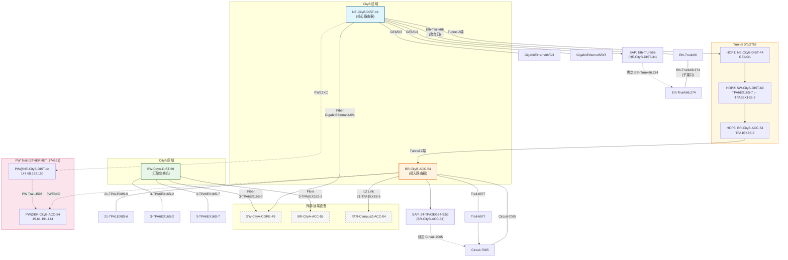

```mermaid

graph TD
    subgraph CityB["CityB 区域"]
        NE["NE-CityB-DIST-44<br/>(核心路由器)"]
        BR["BR-CityB-ACC-54<br/>(接入路由器)"]
    end

    subgraph CityA["CityA 区域"]
        SW["SW-CityA-DIST-69<br/>(汇聚交换机)"]
    end

    subgraph 外部设备["外部/远端设备"]
        EXT1["SW-CityA-CORE-49"]
        EXT2["BR-CityA-ACC-55"]
        EXT3["RTR-CampusZ-ACC-04"]
    end

    %% === 物理链路 (Fiber / L2 Link) ===
    NE -->|"Fiber<br/>GigabitEthernet4/0/1"| EXT1
    SW -->|"Fiber<br/>3-TPA6EX16S-7"| EXT1
    SW -->|"Fiber<br/>3-TPA6EX16S-2"| EXT2
    BR -->|"L2 Link<br/>21-TPA1EX8S-6"| EXT3

    %% === NE-CityB-DIST-44 内部接口 ===
    NE ---|"Eth-Trunk66<br/>(聚合口)"| NE_TRUNK["Eth-Trunk66"]
    NE ---|"GE6/0/3"| NE_GE6["GigabitEthernet6/0/3"]
    NE ---|"GE5/0/3"| NE_GE5["GigabitEthernet5/0/3"]
    NE_TRUNK ---|"Eth-Trunk66.274<br/>(子接口)"| NE_SUB["Eth-Trunk66.274"]

    %% === BR-CityB-ACC-54 内部接口 ===
    BR ---|"Trail-6977"| BR_TRAIL["Trail-6977"]
    BR ---|"21-TPA1EX8S-6"| BR_TPA21["21-TPA1EX8S-6"]
    BR ---|"Circuit-7065"| BR_CIR["Circuit-7065"]
    BR_TRAIL --> BR_CIR

    %% === SW-CityA-DIST-69 内部接口 ===
    SW ---|"3-TPA6EX16S-2"| SW_TPA2["3-TPA6EX16S-2"]
    SW ---|"3-TPA6EX16S-7"| SW_TPA7["3-TPA6EX16S-7"]

    %% === Tunnel 0/0/2786 (NE ↔ BR) ===
    subgraph Tunnel["Tunnel 0/0/2786"]
        T_HOP1["HOP1: NE-CityB-DIST-44<br/>GE4/0/1"]
        T_HOP2["HOP2: SW-CityA-DIST-69<br/>TPA6EX16S-7 ↔ TPA6EX16S-2"]
        T_HOP3["HOP3: BR-CityB-ACC-54<br/>TPA1EX8S-6"]
    end
    NE -->|"Tunnel A端"| T_HOP1
    T_HOP1 --> T_HOP2
    T_HOP2 --> T_HOP3
    T_HOP3 -->|"Tunnel Z端"| BR

    %% === PW (伪线) ===
    subgraph PW["PW Trail (ETHERNET, 174691)"]
        PW_NE["PW@NE-CityB-DIST-44<br/>147.68.192.150"]
        PW_BR["PW@BR-CityB-ACC-54<br/>45.64.191.144"]
    end
    NE -.->|"PWE3XC"| PW_NE
    BR -.->|"PWE3XC"| PW_BR
    PW_NE -.->|"PW Trail-4598"| PW_BR

    %% === Service Access Points ===
    SAP_BR["SAP: 24-TPA2EG24-9:53<br/>(BR-CityB-ACC-54)"]
    SAP_NE["SAP: Eth-Trunk66<br/>(NE-CityB-DIST-44)"]
    BR --> SAP_BR
    NE --> SAP_NE
    SAP_BR -.->|"绑定 Circuit-7065"| BR_CIR
    SAP_NE -.->|"绑定 Eth-Trunk66.274"| NE_SUB

    style NE fill:#e1f5fe,stroke:#01579b,stroke-width:2px
    style BR fill:#fff3e0,stroke:#e65100,stroke-width:2px
    style SW fill:#e8f5e9,stroke:#1b5e20,stroke-width:2px
    style EXT1 fill:#f5f5f5,stroke:#616161,stroke-dasharray: 5 5
    style EXT2 fill:#f5f5f5,stroke:#616161,stroke-dasharray: 5 5
    style EXT3 fill:#f5f5f5,stroke:#616161,stroke-dasharray: 5 5
    style Tunnel fill:#fff8e1,stroke:#ff6f00,stroke-width:1px
    style PW fill:#fce4ec,stroke:#c2185b,stroke-width:1px

```
